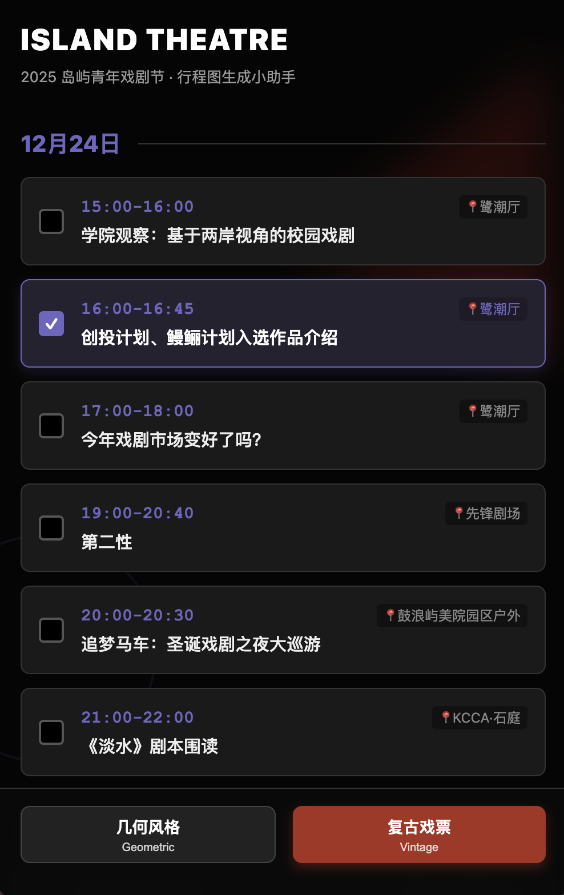
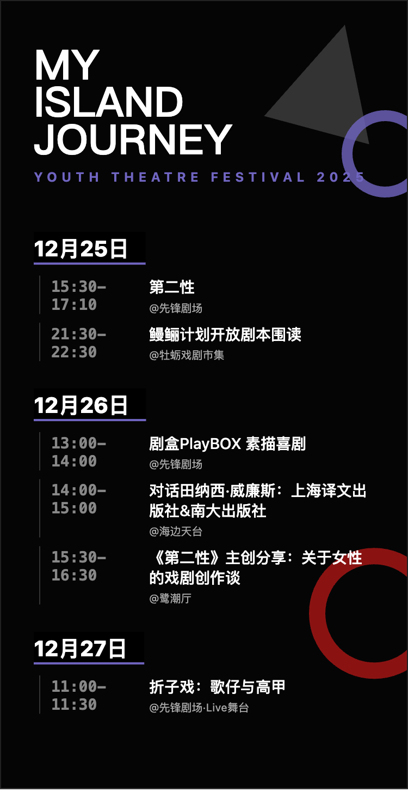
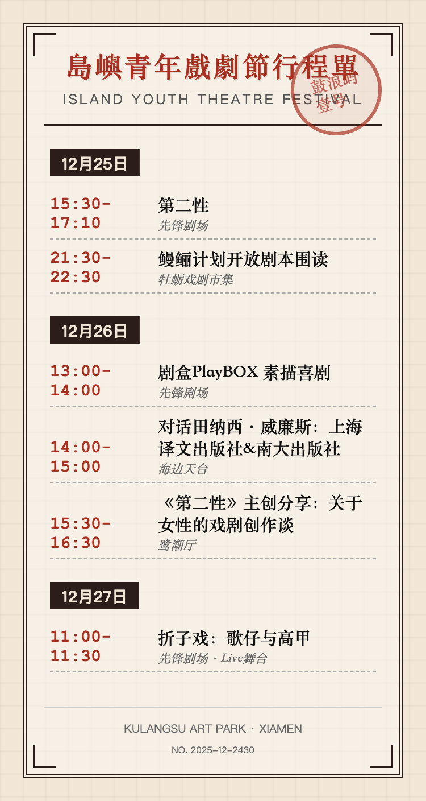

# 🎭 Island Youth Theatre Festival Schedule Generator
# (2025 岛屿青年戏剧节 · 行程定制助手)

A mobile-first web application that allows attendees of the Island Youth Theatre Festival (Kulangsu, Xiamen) to curate their own itinerary and generate shareable, aesthetic schedule posters.

Direct usage link: https://ellezaaaa.github.io/island-youth-theatre-festival/

## ✨ Features

* **Interactive Schedule:** Browse the full festival lineup (Dec 24 - Dec 30) with accurate times and durations.
* **Smart Time Calculation:** Automatically calculates end times based on event duration (e.g., selects "15:00", displays "15:00 - 16:00").
* **Venue Mapping:** Automatically maps specific events to their locations (e.g., "Second Sex" -> "Avant-Garde Theatre").
* **Dual Visual Styles:**
    * **Geometric (Classic):** A modern, high-contrast black & purple design inspired by the official festival visual identity.
    * **Vintage (Retro Ticket):** A skeuomorphic design mimicking old tickets/newspapers with paper textures, stamps, and double-line borders.
* **Image Generation:** Uses `html2canvas` to render high-resolution (3x scale) PNGs directly in the browser.
* **Cross-Device Compatibility:** Optimized to generate perfect mobile-sized posters (375px width) even when used on a desktop computer.

## 📸 Screenshots

| **Selection Interface** | **Geometric Style** | **Vintage Style** |
|:---:|:---:|:---:|
|  |  |  |

## 🛠️ Tech Stack

* **HTML5 & CSS3:** For structure and styling (Flexbox, CSS Variables, Backdrop Filters).
* **Vanilla JavaScript:** For logic, DOM manipulation, and data handling.
* **[html2canvas](https://html2canvas.hertzen.com/):** For rendering DOM elements into canvas images.

## 🚀 How to Run

1.  **Clone the repository:**
    ```bash
    git clone [https://github.com/ellezaaaa/island-youth-theatre-festival.git](https://github.com/ellezaaaa/island-youth-theatre-festival.git)
    ```
2.  **Open the file:**
    Simply open `index.html` in any modern web browser (Chrome, Safari, Edge).
3.  **No dependencies required:** This is a standalone, single-file application.

## 📱 Usage

1.  Open the webpage.
2.  Scroll through the dates and check the boxes for the plays/workshops you wish to attend.
3.  Click either **"Geometric"** or **"Vintage"** at the bottom of the screen.
4.  Wait for the generator to render the image.
5.  Long-press (mobile) or right-click (desktop) to save your personalized schedule.

## 🎨 Design Details

The project focuses heavily on aesthetic fidelity to the festival's brand:
* **Color Palette:** Uses `#7065c1` (Purple) and `#e31d1a` (Red) as primary accents against a `#050505` (Dark) background.
* **Typography:** Uses *Helvetica Neue* for modern elements and *Songti SC* (Serif) for the retro ticket style.
* **Visual Fixes:** Includes specific logic to prevent text overlap (z-index layering) and ensures text readability against complex geometric backgrounds.

## 📄 License

This project is open source. 
*Event data and visual assets belong to the Island Youth Theatre Festival.*

---

**Author:** @ellezaaaa, vibe coded using Gemini
